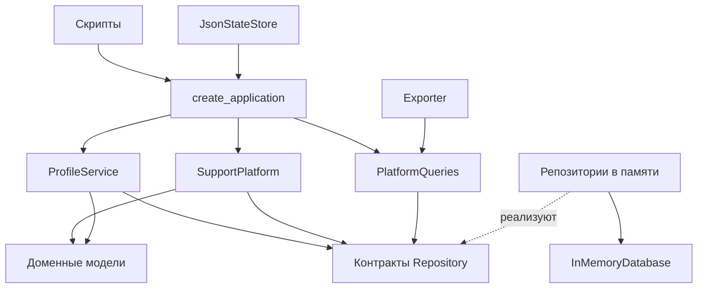

# Support Platform

Учебная платформа поддержки на Python 3.11+: регистрация профилей, обращения пользователей,
назначение операторов, очередь ожидания, сообщения, оценки CSAT и выгрузки в JSON.
Для запуска нужна только стандартная библиотека.

## Быстрый запуск

Из корня проекта:

```bash
python scripts/generate_chats.py --seed 42 --start 2026-01-01
python scripts/export_examples.py --seed 42
python scripts/export_examples.py --all --quiet
```

Первый скрипт создаёт 10 операторов, 40 пользователей и 120 чатов в `data/platform_state.json`.
Количество записей настраивается флагами `--operators`, `--users`, `--chats`.
Для демонстрационного сценария требуется не меньше 100 чатов; библиотека допускает и меньшие наборы.
Флаг `--max-active` задаёт количество одновременных чатов оператора: по умолчанию 3 в генераторе
и 1 при обычном создании приложения. `--show 0` отключает печать историй.

Второй скрипт сохраняет отчёты в `exports/`. По умолчанию он читает существующее состояние.
Если файла нет, скрипт генерирует и сохраняет новый набор. Изменение профилей и создание
дополнительного обращения включаются явно:

```bash
python scripts/export_examples.py --demo
```

`--verbose` печатает полный JSON, `--quiet` отключает печать выгрузок. Сообщения демонстрации
с `--demo` остаются видны. Оба скрипта принимают `--state`, экспорт также принимает `--output-dir`.
Это позволяет работать с отдельным набором, сохраняя исходные примеры:

```bash
python scripts/generate_chats.py --state demo/state.json --seed 42 --start 2026-01-01
python scripts/export_examples.py --state demo/state.json --output-dir demo/exports --all
```

Скрипты можно запускать из другого каталога, указывая путь к ним. Пути по умолчанию считаются
от корня проекта; переданные относительные пути — от текущего каталога.

## Пример использования

```python
from support_platform import Exporter, JsonStateStore, create_application

app = create_application()
operator = app.profiles.register_operator(
    "Иван Иванов", "Москва", "1990-05-10", "Оператор поддержки", 4
)
user = app.profiles.register_user("Анна Петрова", "Орёл", "1995-01-20", "Бухгалтер", 6)

chat = app.platform.create_chat(user.id, "Не могу войти в кабинет")
app.platform.operator_reply(chat.id, "Отправил ссылку для восстановления пароля")
app.platform.close_chat(chat.id)
app.platform.rate_chat(chat.id, 5)

updated_user = app.profiles.update_user(user.id, city="Курск")
print(app.queries.stats())
Exporter(app.queries).export_all_chats()

store = JsonStateStore()
store.save(app, "demo/state.json")
restored = store.load("demo/state.json")
```

Профили и сообщения неизменяемы. Обновление профиля возвращает новый объект после проверки
всех полей; прежний объект остаётся прежним. Изменения чатов выполняются через `app.platform`.
Для получения актуального состояния используется `app.queries.get_chat(chat.id)`.

## Архитектура

Разделение доступа к данным и предметной логики основано на
[главе Repository Pattern из Architecture Patterns with Python](https://www.cosmicpython.com/book/chapter_02_repository).

| Файл | Ответственность |
| --- | --- |
| `support_platform/models.py` | Сущности, допустимые переходы состояния и проверки предметных правил |
| `support_platform/repositories.py` | Контракты репозиториев через `Protocol` |
| `support_platform/storage.py` | Отдельная `InMemoryDatabase`: словари, последовательности ID и индексы; реализации репозиториев |
| `support_platform/core.py` | `SupportPlatform`: создание, назначение, переписка, закрытие и оценка чатов |
| `support_platform/profiles.py` | Регистрация и обновление профилей |
| `support_platform/queries.py` | Получение данных, выборки и статистика |
| `support_platform/application.py` | Сборка приложения и внедрение зависимостей |
| `support_platform/serialization.py` | Преобразование моделей в записи JSON и обратно |
| `support_platform/persistence.py` | Загрузка и сохранение снимка приложения |
| `support_platform/json_io.py` | Атомарная запись JSON через временный файл |
| `support_platform/exporter.py` | Подготовка файлов выгрузок и консольного представления |
| `support_platform/generator.py` | Генерация профилей и последовательная симуляция обращений |
| `tests/` | Доменные сценарии, контракты репозиториев, файлы, генератор и CLI |



`SupportPlatform` не содержит словарей с данными, счётчиков ID, сериализации или файлового ввода-вывода.
Он знает только контракты репозиториев и доменные операции. Регистрация оператора вызывает
раздачу очереди через обработчик, который связывается в `create_application`.
Так сервис профилей не зависит от конкретного класса платформы.

Модели не знают о JSON и хранилище. У чата есть операции `assign`, `add_message`, `close`, `rate`:
проверки переходов находятся рядом с состоянием, которое защищают.

## Хранилище и его замена

Словари существуют отдельно от платформы и репозиториев:

```python
from support_platform import InMemoryDatabase, create_application, memory_repositories

database = InMemoryDatabase()
repositories = memory_repositories(database)
app = create_application(repositories)
```

Каждый обычный вызов `create_application()` создаёт отдельную базу.
Два набора репозиториев над одной `InMemoryDatabase` разделяют данные, индексы и последовательности ID.
Сервисы работают с этой базой только через репозитории.

Общий контракт: `next_id`, `add`, `get`, `save`, `list`.
Репозиторий чатов дополнительно предоставляет выборки, очередь и количество открытых чатов
по операторам. `get` и `save` для отсутствующей записи вызывают `NotFoundError`,
повторный `add` — `DuplicateError`. Выборки возвращаются по возрастанию ID;
очередь имеет собственный порядок FIFO. Импортированный ID учитывается при выдаче следующего.
Пропуски в последовательности после отклонённых операций допустимы.

После изменения сущности сервис явно вызывает `save`. Это существенно для хранилищ,
возвращающих независимые объекты. В `tests/fakes.py` реализован репозиторий на списке,
который копирует объекты на чтении и записи. Один набор бизнес-тестов выполняется и с ним,
и с основным репозиторием. Тем самым проверяется возможность замены хранилища без изменения сервисов.

Для другого хранилища нужно реализовать эти контракты и передать реализации в `Repositories`:

```python
from support_platform import Repositories, create_application


def build_application(operator_repository, user_repository, chat_repository):
    repositories = Repositories(operator_repository, user_repository, chat_repository)
    return create_application(repositories)
```

В проекте реализовано хранилище в памяти. `JsonStateStore` сохраняет его снимок и восстанавливает
новое приложение в памяти; JSON не является транзакционной базой. SQL-адаптер в этот проект не входит.

## Правила и целостность

- Чат назначается случайному оператору с доступной ёмкостью. При отсутствии свободных операторов
  он ждёт в очереди. Закрытие чата или регистрация оператора запускает раздачу очереди.
- Пользователь может дописывать в ожидающий и открытый чат. Оператор отвечает и закрывает
  только назначенный открытый чат. Отправитель сообщения должен быть участником чата.
- CSAT — целое число от 1 до 5, только после закрытия и только один раз. `bool` не принимается.
- Пустые строки, отрицательный стаж, некорректные даты рождения и неположительная ёмкость
  оператора отклоняются с `ValidationError`.
- Все события используют локальный `datetime` без часового пояса с точностью до секунды.
  Событие не может предшествовать созданию чата или последнему сообщению.
  Часы и генератор случайных чисел можно передать как зависимости.
- Занятость оператора определяется открытыми чатами. `active_chat_ids` и `is_free` в JSON
  вычисляются при выгрузке. Сохранённые значения этих полей не используются как источник истины.
- Загрузчик проверяет ссылки между сущностями, уникальность ID, сообщения, статусы,
  лимиты операторов и соответствие очереди ожидающим чатам.
- Старый `data/platform_state.json` читается без миграции. Старые `counters` игнорируются:
  новые ID вычисляются по загруженным записям, поэтому устаревший счётчик не перезапишет данные.
- Сохранение пишет временный файл в том же каталоге, сбрасывает буферы и заменяет целевой файл.
  Ошибка записи или замены оставляет предыдущий файл на месте.

## Производительность

Чаты индексируются по пользователю, оператору и статусу. Очередь использует `OrderedDict`:
получение первого элемента и удаление при назначении занимают O(1).
Индексы обновляются при сохранении изменений. Чтение первого ожидающего чата не сортирует данные.

Статистика агрегирует чаты за один проход. Выгрузки профилей тоже собирают счётчики одним
проходом по чатам, без повторного просмотра всей истории для каждого человека.
Выборка участника обрабатывает только его `k` чатов и сортирует результат за O(k log k).
Общие списки сортируются по ID один раз на запрос; сама агрегация линейная.
Цена индексов — дополнительная память O(C), где C — количество чатов.

Локальный замер на Windows, Python 3.13.14: 10 000 чатов, 100 операторов, 1 000 пользователей.
Медиана семи запусков.

| Операция | До | После |
| --- | ---: | ---: |
| Статистика платформы | 44,1 мс | 2,1 мс |
| Выборки чатов для всех 1 000 пользователей | 351,5 мс | 0,76 мс |

Это результат конкретного локального измерения. Для измерения текущей версии:

```bash
python scripts/benchmark.py --chats 10000 --iterations 7
```

Для воспроизводимых данных генератору нужны одновременно `seed` и фиксированный `start`.
Возраст в отчёте рассчитывается на день выгрузки. Генератор использует свой `random.Random`
и не изменяет глобальное состояние `random`. Следующее обращение приходит после последнего
разыгранного события, поэтому освободившийся слот не используется задним числом.
Доли закрытия и оценки вероятностные: небольшой набор не обязан содержать каждый статус.

## Проверки

Тесты не требуют сторонних библиотек:

```bash
python -m unittest discover -v
```

Проверки разработки в PowerShell:

```powershell
python -m venv .venv
.\.venv\Scripts\python.exe -m pip install -e ".[dev]"
.\.venv\Scripts\python.exe -m ruff check .
.\.venv\Scripts\python.exe -m ruff format --check .
.\.venv\Scripts\python.exe -m mypy
.\.venv\Scripts\python.exe -m unittest discover -v
```

На Linux/macOS путь к Python в окружении — `.venv/bin/python`.
Тесты работают с временными каталогами и не перезаписывают `data/` и `exports/`.
Проверяются очередь и нагрузка, жизненный цикл, недопустимые входные данные, атомарность
обновления профиля, подмена репозитория, загрузка старого формата, сбои записи,
все виды экспорта и запуск CLI из другого каталога.

## Ключевые архитектурные решения

1. **Repository и Dependency Inversion.** Сервис зависит от контракта доступа к данным.
   Словари и их индексы принадлежат инфраструктуре. `Protocol` позволяет проверять контракт
   статически без обязательного наследования реализаций.
2. **Разделение обязанностей.** Модели защищают правила сущностей, платформа координирует
   работу с чатами, профили обновляет отдельный сервис, отчёты читает `PlatformQueries`.
   Сериализация и запись файлов вынесены за пределы домена.
3. **Один источник состояния.** Нагрузка и очередь выводятся из статусов чатов.
   Индексы ускоряют чтение, но перестраиваются при загрузке и не заменяют сами записи.
4. **Тестируемость.** Управляемые часы и случайность делают сценарии воспроизводимыми.
   Репозиторий с копированием объектов выявляет забытые вызовы `save`.
5. **Цена решений.** Дополнительные классы и индексы оправданы независимостью бизнес-логики,
   проверяемыми контрактами и частыми выборками. Полноценные ORM, брокер событий и Unit of Work
   для текущей симуляции не требуются.

Текущий запуск рассчитан на один процесс и последовательные вызовы. Репозиторий в памяти
возвращает изменяемый `Chat`, поэтому его поля следует менять через сервисы, которые сохраняют
изменения и обновляют индексы. При переходе к конкурентному серверу понадобятся транзакции
для назначения чата и проверки ёмкости, защита от одновременных обновлений и явная политика UTC.
Атомарная замена JSON защищает файл от частичной записи, но не разрешает конфликт двух писателей.


